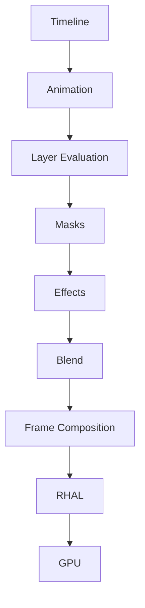

# 005 Rendering Engine Specification

**Engine Codename:** Aurora  
**Document Version:** 0.1.0  
**Status:** Draft

---

# Purpose

Aurora is the rendering engine responsible for converting project data into rendered frames for preview and export.

---

# Goals

- Real-time preview
- Deterministic rendering
- GPU acceleration
- Modular architecture
- Non-destructive processing

---

# Responsibilities

- Frame composition
- Layer rendering
- Blend modes
- Mask processing
- Effect execution
- Frame cache
- Preview rendering
- Export rendering

---

# High-Level Pipeline

---

# Rendering Hardware Abstraction Layer (RHAL)

Aurora communicates only with RHAL.

RHAL selects:

- Vulkan (Preferred)
- OpenGL ES (Fallback)

Future backends may be added without modifying Aurora.

---

# Layer Rendering Order

1. Evaluate visibility
2. Resolve transforms
3. Apply masks
4. Execute effects
5. Blend
6. Composite

---

# Frame Cache

Cache types:

- Static
- Dynamic
- Composition

Invalidation occurs only when dependent data changes.

---

# Performance Targets

- 60 FPS preview on capable hardware
- Adaptive quality on lower-end devices
- Background export
- Incremental rendering

---

# Diagnostics

Developer mode exposes:

- FPS
- Frame time
- GPU memory
- CPU usage
- Draw calls
- Cache statistics

---

# Related Documents

- 003 Software Architecture Document
- 004 Architecture Decision Records
- 006 Timeline Engine (planned)

---

# Revision History

- 0.1.0 Initial repository version
