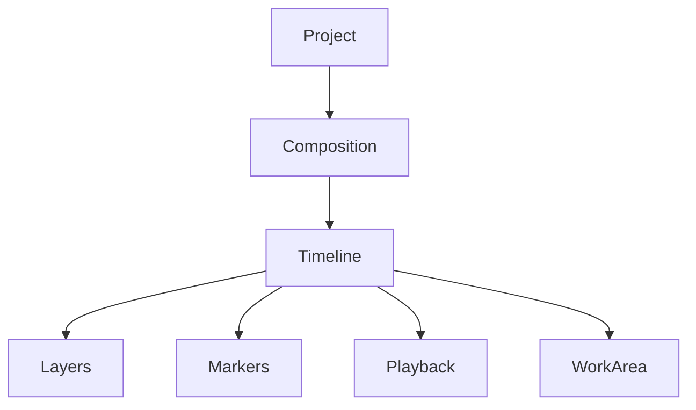
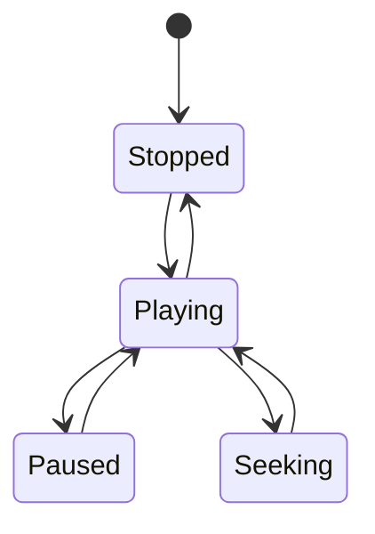

---
title: "006 Timeline Engine Specification"
document_id: MX-ENG-006
engine: Chronos
version: 0.1.0
status: Draft
---

# 006 Timeline Engine Specification

## Purpose

Chronos manages time, playback, layer ordering, and editing operations for every MotionX composition.

## Responsibilities

- Timeline playback
- Layer sequencing
- Frame navigation
- Work area
- Markers
- Nested compositions
- Time remapping
- Undo/Redo integration

## Design Principles

- Frame-accurate editing
- Deterministic playback
- UUID-based layer references
- Non-destructive editing
- Responsive interaction

## Timeline Architecture

## Layer Model

Each layer contains:

- UUID
- Name
- Type
- Start Frame
- End Frame
- Parent
- Visibility
- Lock State
- Animation Reference
- Effect Stack

## Playback States

## Editing Commands

All edits are command-based:

- Add Layer
- Delete Layer
- Duplicate Layer
- Move Layer
- Split Layer
- Trim Layer
- Rename Layer

## Performance Goals

- Smooth scrolling
- Instant seek for cached frames
- Efficient handling of large timelines
- Background cache updates

## Related Documents

- 003_Software_Architecture_Document.md
- 004_Architecture_Decision_Records.md
- 005_Rendering_Engine.md
- 007_Animation_Engine.md (planned)

## Revision History

- 0.1.0 Initial repository version
