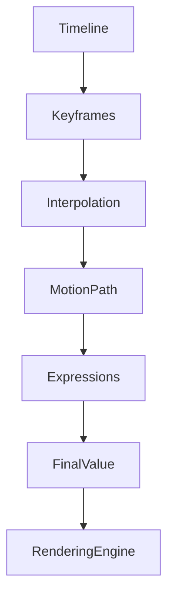
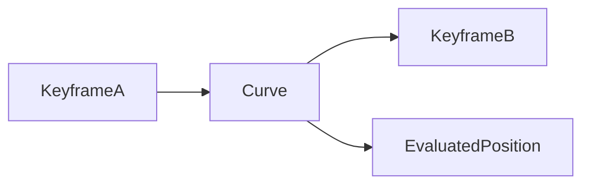

---
title: "007 Animation Engine Specification"
document_id: MX-ENG-007
engine: Apollo
version: 0.1.0
status: Draft
---

# 007 Animation Engine Specification

## Purpose

Apollo evaluates every animated property inside MotionX.

It transforms timeline data into property values for each rendered frame.

---

## Responsibilities

- Keyframe evaluation
- Interpolation
- Motion paths
- Value graphs
- Speed graphs
- Expression evaluation
- Animation cache
- Constraint support (future)

---

## Design Principles

- Frame accurate
- Deterministic
- Independent from rendering
- Highly scalable
- Extensible

---

## Evaluation Pipeline

---

## Animatable Properties

- Position
- Scale
- Rotation
- Opacity
- Anchor Point
- Mask Path (see 010_Shape_Engine.md § Masking)
- Effect Parameters
- Camera Properties
- Audio Volume
- Text Properties

---

## Supported Interpolation

| Type | Status |
|-------|--------|
| Linear | ✅ |
| Hold | ✅ |
| Cubic Bézier | ✅ |
| Easy Ease | ✅ |
| Custom Curves | ✅ |
| Spring | Planned |
| Physics | Planned |

---

## Motion Path Workflow

---

## Graph Editor

Two synchronized graph modes:

- Value Graph
- Speed Graph

Both edit the same underlying keyframe data.

---

## Performance Goals

- Thousands of keyframes
- Cached interpolation
- Minimal allocations
- Incremental updates

---

## Future Features

- Physics animation
- IK
- Procedural animation
- Motion presets
- AI-assisted keyframing

---

## Related Documents

- 005_Rendering_Engine.md
- 006_Timeline_Engine.md
- 008_Effects_Engine.md (planned)

---

## Revision History

- 0.1.0 Initial draft
- 
