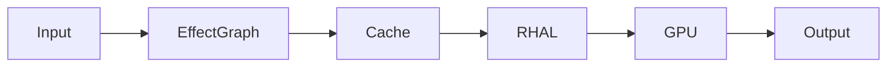
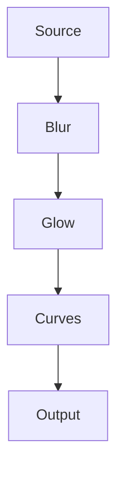

---
title: "008 Effects Engine Specification"
document_id: MX-ENG-008
engine: Nebula
version: 0.2.0
status: Draft
---

# 008 Effects Engine Specification

## Purpose

Nebula is MotionX's non-destructive image processing engine. It applies visual effects to layers and compositions while preserving the original source media.

## Objectives

- GPU-first processing
- Modular effect architecture
- Animatable parameters
- Deterministic rendering
- Future plugin support

## Architecture

## Effect Categories

- Blur
- Color Correction
- Stylize
- Distortion
- Noise
- Utility
- Simulation (Future)

## Internal Effect Graph

Effects are evaluated as a directed processing graph rather than hard-coded sequential routines.

## Effect Lifecycle

1. Register
2. Initialize
3. Validate Parameters
4. Render
5. Cache Result
6. Dispose

## Parameters

Supported parameter types:

- Float
- Integer
- Boolean
- Color
- Vector2
- Vector3
- Gradient
- Image Reference
- Enum

Every parameter may be animated through the Apollo Animation Engine.

## GPU Pipeline

Preferred backend:

- Vulkan

Fallback:

- OpenGL ES

All GPU communication is routed through the Rendering Hardware Abstraction Layer (RHAL).

## Caching

- Layer cache
- Effect cache
- Texture cache
- Intermediate pass cache

Only invalidated nodes are recomputed.

## Error Handling

If an effect fails:

- Disable the effect
- Preserve the project
- Continue rendering remaining effects
- Record diagnostics

## Future Work

- Node editor
- Plugin SDK
- Compute shaders
- AI-assisted effects
- Community preset library

## Related Documents

- 005_Rendering_Engine.md
- 007_Animation_Engine.md
- 004_Architecture_Decision_Records.md

## Revision History

- 0.2.0 Repository edition
