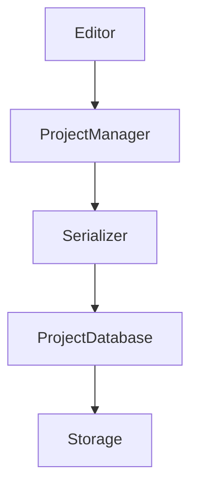

---
title: 009 Project Engine Specification
document_id: MX-ENG-009
engine: Atlas
version: 0.2.0
status: Draft
---

# 009 Project Engine Specification

## Purpose
Atlas manages project persistence, serialization, autosave, recovery, versioning, and asset references.

## Responsibilities
- Create/Open/Save projects
- Autosave
- Crash recovery
- Asset registry
- Version migration
- Import/Export

## Architecture



## Project Package

```text
Project.mxproj/
├── project.json
├── assets/
├── cache/
├── previews/
├── autosave/
└── metadata/
```

## Core Objects
- Project
- Composition
- Asset
- Layer
- Settings
- Metadata

All persistent objects use UUIDs.

## Autosave
- Background operation
- Incremental writes
- Configurable interval
- Trigger before export

## Recovery
1. Detect recovery data
2. Validate
3. Offer restore
4. Preserve last manual save

## Versioning
Every project stores:
- Format version
- Engine version
- Minimum supported version

## Integrity Checks
- Missing assets
- Broken references
- Duplicate UUIDs
- Schema validation

## Future
- Cloud sync
- Collaboration
- Version history
- Asset deduplication

## Related
- 003_Software_Architecture_Document.md
- 004_Architecture_Decision_Records.md
- 005_Rendering_Engine.md

## Revision History
- 0.2.0 Initial repository edition
