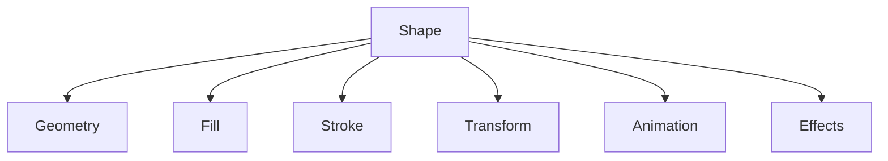
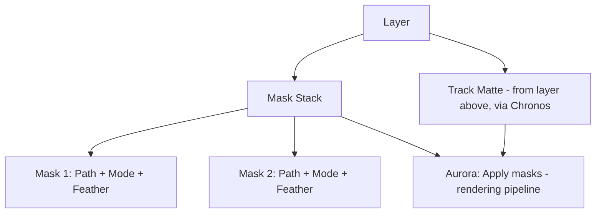

# 010 Shape Engine Specification

## Purpose

The Vector Engine provides MotionX with a professional vector graphics system for creating and animating scalable shapes without relying on raster assets.

## Objectives

- Resolution-independent graphics
- GPU-accelerated rendering
- Fully animatable properties
- Non-destructive editing
- High-performance vector rendering

## Supported Shape Types

### Basic Shapes

- Rectangle
- Rounded Rectangle
- Ellipse
- Circle
- Polygon
- Star
- Line

### Advanced Shapes

- Bézier Path
- Compound Path
- Shape Group
- Imported SVG (Future)

## Shape Components

## Fill Types

- Solid Color
- Linear Gradient
- Radial Gradient
- Image Fill (Future)
- Pattern Fill (Future)

## Stroke Properties

- Width
- Color
- Opacity
- Cap Style
- Join Style
- Dash Pattern
- Miter Limit

All stroke properties are animatable.

## Vector Operations

- Merge
- Union
- Intersect
- Subtract
- Exclude

## Shape Modifiers

- Trim Paths
- Repeater
- Offset Paths
- Rounded Corners
- Zig Zag
- Twist (Future)
- Pucker & Bloat (Future)

## Animation Integration

Apollo Animation Engine can animate:

- Position
- Rotation
- Scale
- Fill
- Stroke
- Path Vertices
- Gradient Stops
- Modifier Parameters

## Masking

Masks were referenced as a v1 feature in 002_Product_Requirements_Document.md, as a rendering pipeline step in 005_Rendering_Engine.md ("Apply masks"), and as an animatable property in 007_Animation_Engine.md ("Mask Path") — this section is the authoritative specification those references point to.

A **mask** is a Bézier path (built with the same path tools as any Vector shape) attached to a layer to define which portion of that layer's content is visible. Masks are a layer-level concept, not a shape-layer-only one: any layer type (shape, text, image, video) can carry a mask stack.

### Mask Properties

| Property | Description |
|---|---|
| Path | Bézier path defining the mask boundary — animatable via Apollo, same as any Vector path |
| Mode | How this mask combines with masks below it in the stack (see Mask Modes) |
| Opacity | Mask strength, 0–100% |
| Feather | Soft edge width applied to the mask boundary |
| Expansion | Grows/shrinks the mask boundary outward or inward before feathering |
| Inverted | Flips which side of the path is visible |

### Mask Modes

| Mode | Effect |
|---|---|
| Add | Union with masks above |
| Subtract | Cuts out the mask area |
| Intersect | Keeps only the overlapping area |
| Lighten | Keeps the lighter (more visible) result at each pixel |
| Darken | Keeps the darker (less visible) result at each pixel |
| Difference | Visible where exactly one of the two masks is visible, not both |

A layer's **Mask Stack** (see 006_Timeline_Engine.md § Layer Model) is an ordered list of masks combined top-to-bottom using these modes — matching the mental model creators already have from desktop compositing tools, per the Feature Philosophy in the master project instructions (innovate on interaction, not on concepts creators already understand).

### Track Mattes

Distinct from a layer's own mask stack: a **track matte** uses one layer's alpha channel or luminance as a mask source for the layer directly below it in Chronos's stacking order. This is a Chronos/Aurora coordination concern (which layer masks which) built on top of Vector's path/shape system for the matte source content itself — Vector does not own track matte logic, only the shape/path data that can serve as one.

### Relationship to Vector Operations and AI

- Mask paths are edited with the same tools as any Bézier path in this engine — no separate "mask drawing mode," consistent with the mobile-first principle of not multiplying tools that do the same underlying thing
- This section is what 019_AI_Features.md's Object Selection and Auto Masking/Rotoscoping features actually accelerate: AI-proposed boundaries are delivered as editable mask paths using this exact model, not a separate AI-only mask type

## Rendering Pipeline

## Performance Goals

- Thousands of vector objects
- Cached tessellation
- Incremental updates
- GPU-accelerated rendering
- Adaptive quality

## Future Roadmap

- SVG import/export
- Parametric shapes
- Shape libraries
- Boolean editor
- Live corners
- Shape templates

## Related Documents

- 005_Rendering_Engine.md
- 006_Timeline_Engine.md
- 007_Animation_Engine.md
- 008_Effects_Engine.md
- 019_AI_Features.md (Object Selection / Auto Masking accelerate this engine's mask model)

## Revision History

- 0.2.0 Initial repository edition
- 0.2.1 Added Masking section (mask paths, modes, track mattes) — closes gap where PRD/Rendering/Animation referenced masks without a defining spec
- 
