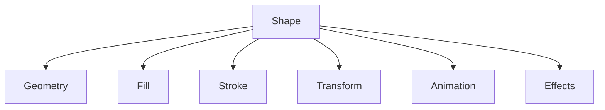

# 010 Shape Engine Specification

## Purpose

The Vector Engine provides MotionX with a professional vector graphics system for creating and animating scalable shapes without relying on raster assets.

## Objectives

- Resolution-independent graphics
- GPU-accelerated rendering
- Fully animatable properties
- Non-destructive editing
- High-performance vector rendering

## Supported Shape Types

### Basic Shapes

- Rectangle
- Rounded Rectangle
- Ellipse
- Circle
- Polygon
- Star
- Line

### Advanced Shapes

- Bézier Path
- Compound Path
- Shape Group
- Imported SVG (Future)

## Shape Components

## Fill Types

- Solid Color
- Linear Gradient
- Radial Gradient
- Image Fill (Future)
- Pattern Fill (Future)

## Stroke Properties

- Width
- Color
- Opacity
- Cap Style
- Join Style
- Dash Pattern
- Miter Limit

All stroke properties are animatable.

## Vector Operations

- Merge
- Union
- Intersect
- Subtract
- Exclude

## Shape Modifiers

- Trim Paths
- Repeater
- Offset Paths
- Rounded Corners
- Zig Zag
- Twist (Future)
- Pucker & Bloat (Future)

## Animation Integration

Apollo Animation Engine can animate:

- Position
- Rotation
- Scale
- Fill
- Stroke
- Path Vertices
- Gradient Stops
- Modifier Parameters

## Rendering Pipeline

## Performance Goals

- Thousands of vector objects
- Cached tessellation
- Incremental updates
- GPU-accelerated rendering
- Adaptive quality

## Future Roadmap

- SVG import/export
- Parametric shapes
- Shape libraries
- Boolean editor
- Live corners
- Shape templates

## Related Documents

- 005_Rendering_Engine.md
- 006_Timeline_Engine.md
- 007_Animation_Engine.md
- 008_Effects_Engine.md

## Revision History

- 0.2.0 Initial repository edition
