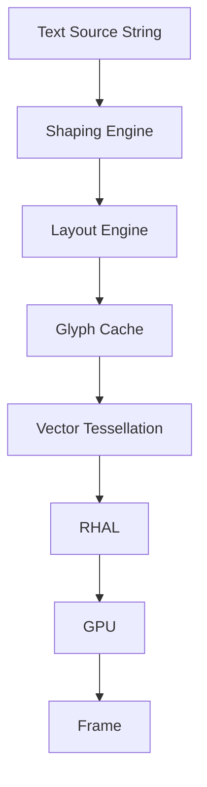
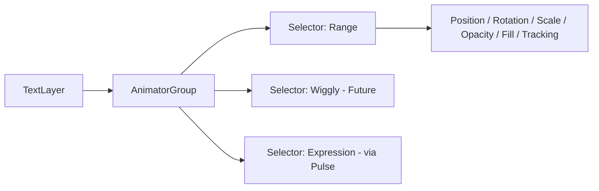

# 011 Text Engine Specification

## Purpose

Glyph is MotionX's text layout, shaping, and rendering engine. It converts character data and typographic settings into resolution-independent, animatable text layers that composite through the same pipeline as every other layer type.

## Objectives

- Resolution-independent text rendering (vector-based, not rasterized-then-scaled)
- Full animatability — down to the character level, not just the layer level
- Non-destructive text editing (source text string is always preserved)
- Multi-script and emoji support
- GPU-accelerated glyph rendering

## Responsibilities

- Font loading and fallback resolution
- Text shaping (glyph selection, ligatures, kerning)
- Line breaking and paragraph layout
- Path-based text layout (text-on-path)
- Per-character / per-word / per-line animation targeting
- Text-to-shape conversion (for boolean ops with Vector engine)
- Caching of shaped glyph runs

## Architecture

Glyph shares its tessellation and GPU submission path with the Vector engine (010) — a glyph outline is, internally, a compound path. This keeps rendering behavior (fill, stroke, gradients, effects) consistent between shape layers and text layers.

## Text Layer Model

Each text layer contains:

| Property | Description |
|---|---|
| Source String | The raw, editable text content — always preserved |
| Font Reference | Family, style, weight |
| Size / Tracking / Leading | Base typographic metrics |
| Fill / Stroke | Same model as Vector engine (010) |
| Paragraph Settings | Alignment, justification, max width |
| Path Reference (optional) | Bézier path for text-on-path layout |
| Animator Groups | See below |

## Animator Groups

Modeled after range-based text animation (per-character, per-word, per-line), rather than only keyframing the layer as a whole.

An Animator Group applies a set of property offsets to a selected range of characters, words, or lines, with adjustable falloff (ease-high/ease-low) at the range boundaries. Multiple Animator Groups can stack on one text layer.

## Supported Selectors (v1)

| Selector | Status |
|---|---|
| Range (by character) | Planned — MVP |
| Range (by word) | Planned — MVP |
| Range (by line) | Planned — MVP |
| Wiggly (randomized offset) | Future |
| Expression-driven (via Pulse) | Future |

## Text Shaping

- Unicode-aware shaping (complex scripts: Arabic, Devanagari, etc. via HarfBuzz or equivalent)
- Automatic font fallback chain when a glyph is missing from the primary font
- Emoji rendered as embedded color glyphs, not monochrome fallback

## Text-to-Shape Conversion

Text layers can be converted to editable vector shapes (compound paths), after which they:

- Are handed off entirely to the Vector engine (010)
- Support boolean operations (merge, union, subtract, etc.)
- No longer respond to font/size property edits (this is a destructive, explicit user action — the source text layer is duplicated, not overwritten, to preserve the non-destructive principle)

## Caching

- Shaped glyph run cache (keyed by string + font + size — avoids re-shaping unchanged text every frame)
- Tessellated outline cache per glyph, shared across all usages of that glyph at that size (memory efficiency for repeated characters)
- Cache invalidated only when source string, font, or size changes

## Performance Goals

- Sub-frame re-shaping for live text edits (typing should feel instant)
- Cached glyph reuse across layers to avoid redundant tessellation
- Efficient handling of long paragraphs without dropped preview frames

## Error Handling

- Missing font: fall back to system default, flag layer with a non-blocking warning, preserve original font reference in project data (so it can resolve correctly if the font becomes available later, e.g. after asset import)
- Missing glyph in font: fall back through the font fallback chain, then to a visible placeholder glyph rather than silently dropping the character

## Future Work

- Variable font axis animation (weight, width as animatable properties)
- Text-on-path with animatable path offset/spacing
- Wiggly and expression-driven selectors
- Rich text (mixed styling within a single text layer)
- Auto-captions integration (see 019_AI_Features.md, pending) — Glyph is the rendering target for AI-generated caption layers

## Related Documents

- 005_Rendering_Engine.md
- 007_Animation_Engine.md
- 010_Shape_Engine.md
- 014_Expression_Engine.md (pending)

## Revision History

- 0.1.0 Initial draft
