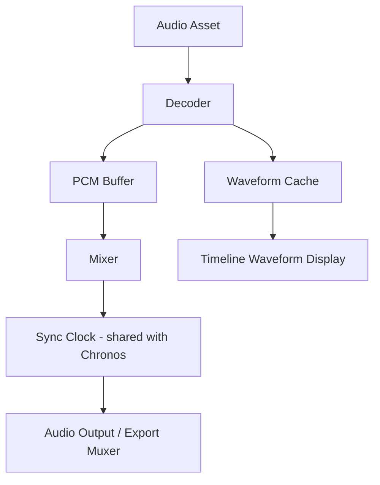
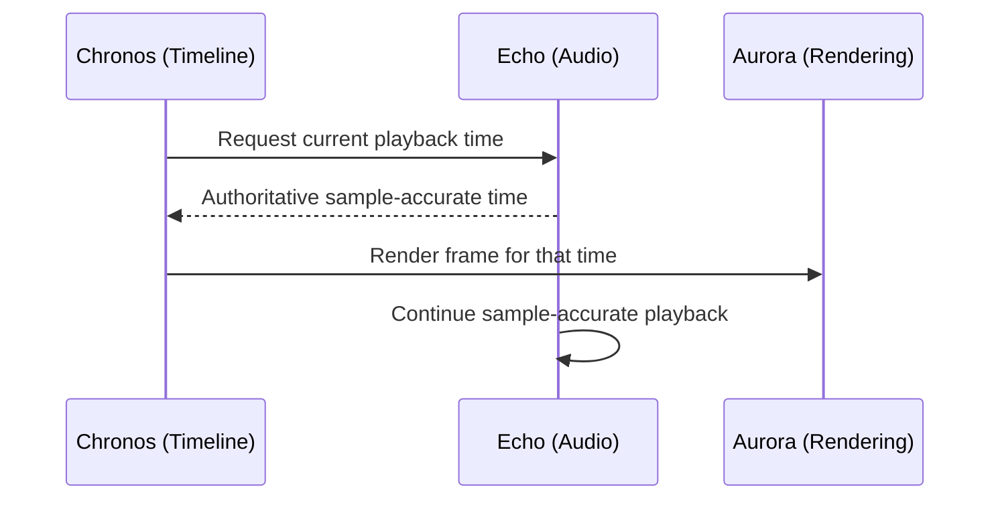

# 012 Audio Engine Specification

## Purpose

Echo manages audio ingestion, playback synchronization, waveform analysis, mixing, and audio-reactive data for MotionX. It keeps sound sample-accurate against Chronos's frame-accurate timeline, which is a fundamentally different precision domain.

## Objectives

- Sample-accurate playback synchronized to frame-accurate timeline
- Non-destructive audio editing (source audio never modified)
- Low-latency scrubbing (audio "chirp" on scrub, matching video editors)
- GPU/CPU-efficient waveform generation for UI display
- Foundation for audio-reactive animation (future, via Pulse expressions)

## Responsibilities

- Audio asset decoding and format normalization
- Waveform extraction and caching for timeline display
- Playback mixing across multiple audio layers
- Volume, pan, and fade keyframing
- Audio-video sync during preview and export
- Audio level metering (peak/RMS) for diagnostics and future auto-ducking

## Architecture

## The Sync Problem

Video timelines are frame-accurate (e.g., 30 fps = ~33.3ms granularity). Audio is sample-accurate (44.1kHz/48kHz = ~0.02ms granularity). Echo owns the authoritative sync clock during playback and export; Chronos requests frame positions from Echo's clock rather than the reverse, since audio drift is far more perceptible to users than a dropped video frame.

## Audio Layer Model

Each audio layer contains:

| Property | Description |
|---|---|
| UUID | Stable reference |
| Asset Reference | Link to source audio asset (never modified) |
| Start / End Frame | Trim points, expressed in timeline frames |
| Offset | Sub-frame sample offset for fine sync adjustment |
| Volume | Animatable via Apollo |
| Pan | Animatable via Apollo |
| Fade In / Out | Duration + curve |
| Waveform Cache Reference | Precomputed display data |
| Mute / Solo State | UI/playback convenience, non-destructive |

## Waveform Generation

- Multi-resolution waveform cache (coarse for zoomed-out timeline, fine for zoomed-in editing) — avoids recomputing on every zoom level change
- Generated on import as a background task; layer usable immediately with a placeholder waveform that resolves once ready
- Cached per-asset, shared across all layers referencing the same asset

## Mixing

- Real-time mix of all active audio layers during preview
- Per-layer volume/pan automation evaluated per audio buffer, not per video frame, to avoid zipper noise from coarse update rates
- Master output stage before device output / export muxer

## Export Integration

- Audio mixed down and muxed with rendered video frames during export (coordinates with Aurora's export path, see 005_Rendering_Engine.md)
- Sample-accurate mixdown independent of the preview playback path, so export fidelity isn't limited by real-time preview mixing shortcuts

## Performance Goals

- No audible sync drift over a 10-minute timeline
- Scrub response under 50ms
- Waveform cache generation does not block editing on import

## Error Handling

- Corrupt/unsupported audio asset: layer preserved with a visible error state, does not block project load or export of other layers
- Missing audio asset: same recovery pattern as missing video/image assets in Atlas (009) — reference preserved, relink offered

## Future Work

- Audio-reactive animation (waveform/frequency data exposed as expression inputs via Pulse, 014)
- Auto-ducking (music level drops under voice, AI-assisted)
- Noise reduction / voice isolation
- Multi-channel / surround support
- Auto beat-detection for cut-to-the-beat editing assistance

## Related Documents

- 005_Rendering_Engine.md
- 006_Timeline_Engine.md
- 007_Animation_Engine.md
- 009_Project_Engine.md
- 014_Expression_Engine.md (pending)

## Revision History

- 0.1.0 Initial draft
