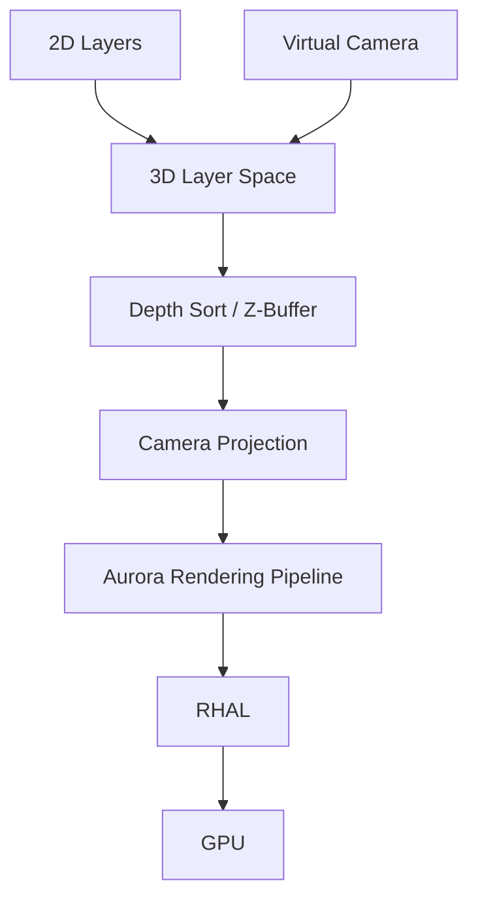
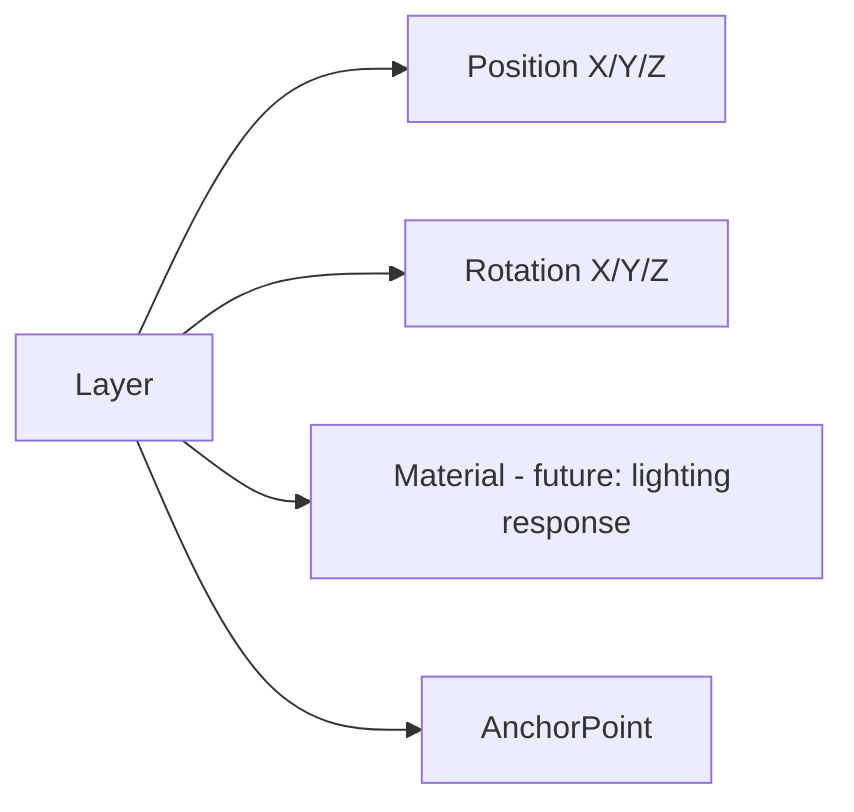

# 013 Camera Engine Specification

## Purpose

Horizon introduces a 3D coordinate space and virtual camera system into MotionX, allowing 2D layers (shapes, text, images, video) to be positioned, rotated, and animated in 3D space and viewed through an animatable camera — without requiring a full 3D modeling/mesh pipeline.

This is the same "2.5D" model used by After Effects: layers remain flat planes, but they exist in 3D space and can be composed, lit, and shot with camera moves.

## Objectives

- 2.5D compositing (flat layers positioned in 3D space)
- Animatable camera (position, point of interest, zoom, depth of field)
- Depth-based compositing and z-sorting
- Compatible with existing 2D layers without requiring per-layer opt-in complexity
- GPU-accelerated, consistent with Aurora's pipeline

## Non-Goals (v1)

- Full 3D mesh/model import — Horizon is not a 3D modeling engine
- Physically-based rendering / global illumination
- Real 3D geometry deformation

These may be reconsidered in a future major version but are explicitly out of scope to keep Horizon shippable.

## Responsibilities

- 3D transform space (position X/Y/Z, rotation X/Y/Z, per layer)
- Virtual camera object: position, point of interest (or free rotation), zoom/focal length, depth of field
- Z-sorting and depth-correct compositing of 2D layers in 3D space
- Basic lighting model (ambient + point/spot lights affecting layer shading — future)
- Camera animation, including multi-camera setups (only one active per composition at render time)

## Architecture

Horizon does not replace Aurora's rendering pipeline — it sits upstream, resolving 3D transforms and camera projection into the same 2D frame buffer that Aurora already composites. Layers that never leave 2D space skip Horizon's projection step entirely, so 2D-only compositions carry no performance cost.

## Camera Object Model

| Property | Description |
|---|---|
| UUID | Stable reference |
| Position | X, Y, Z in 3D space |
| Point of Interest | Target the camera looks at (or free rotation mode) |
| Zoom / Focal Length | Field of view control |
| Depth of Field | Enable/disable, focus distance, aperture, blur strength |
| Near/Far Clip | Rendering bounds |

Multiple camera objects may exist in a composition; only one is active at a given time on the timeline (camera switching is itself a keyframable/markable property, consistent with Chronos's command model).

## Layer 3D Properties (when 3D is enabled per layer)

Enabling 3D on a layer is opt-in and non-destructive — a layer can be toggled between 2D and 3D mode without losing its existing 2D keyframes, which remain valid as the X/Y plane at Z=0.

## Depth Sorting

- Layers sorted by camera-space depth each frame, not by fixed stacking order, once 3D is enabled in a composition
- Compositions with no 3D layers skip depth sorting entirely and render in Chronos's stacking order, exactly as today — this preserves all Phase 1/2 (2D-only) behavior unchanged

## Performance Goals

- Zero performance cost for 2D-only compositions (3D pipeline is skipped, not merely idle)
- Real-time camera preview at target frame rate on capable hardware
- Depth of field as a GPU post-process, cached like other Nebula effects when camera is static

## Diagnostics

Developer mode exposes:

- Active camera transform
- Layer count in 3D space vs 2D-only
- Depth sort cost per frame

## Error Handling

- Invalid camera state (e.g., zero focal length): clamp to safe minimum, do not crash render
- Layer referencing a deleted camera: falls back to default composition camera, flagged non-blocking

## Future Work

- Full lighting model (point, spot, ambient lights with layer material response)
- Camera shake presets
- 3D layer extrusion (giving flat shapes minimal depth/bevel)
- Motion tracking integration (AI-assisted camera solve from footage, see 019_AI_Features.md pending)
- Stereoscopic/VR camera output

## Related Documents

- 005_Rendering_Engine.md
- 006_Timeline_Engine.md
- 007_Animation_Engine.md
- 008_Effects_Engine.md

## Revision History

- 0.1.0 Initial draft
