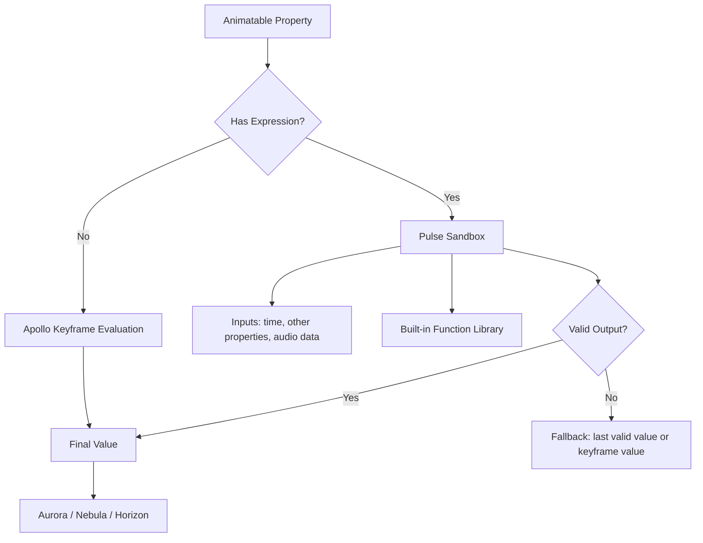
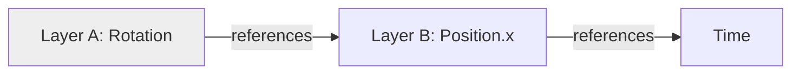

# 014 Expression Engine Specification

## Purpose

Pulse lets any animatable property be driven by a small, sandboxed expression instead of (or on top of) manual keyframes — linking properties together, generating procedural motion, and consuming external data (audio levels, other layers' transforms) without hand-keyframing every frame.

Pulse is additive: it never replaces manual keyframing as the primary workflow. Per the AI Philosophy and mobile-first principles in the master instructions, expressions are a power-user accelerator layered on top of a fully functional keyframe system — not a required step for basic animation.

## Objectives

- Any animatable property (from Apollo, Vector, Glyph, Nebula, Horizon) can accept an expression
- Sandboxed, deterministic evaluation — no arbitrary code execution, no non-deterministic output
- Touch-friendly authoring — expressions must be usable without a hardware keyboard as the primary input method
- Safe failure — a broken expression never crashes the app or blocks rendering
- Performance-bounded — expressions cannot introduce unbounded loops or runaway evaluation cost

## Responsibilities

- Expression parsing and validation
- Sandboxed evaluation per property per frame
- Property linking (one property's value referencing another layer's property)
- Built-in expression function library (wiggle, loop, time, math helpers)
- Expression error detection and non-blocking fallback

## Non-Goals (v1)

- General-purpose scripting / plugin logic (that belongs to a future Plugin SDK, see 015_Roadmap.md Phase 3)
- Network access or any I/O from within an expression
- Mutating project structure (adding/removing layers) from an expression

## Architecture

Expressions evaluate downstream of Apollo's keyframe interpolation, not instead of it — an expression can read a property's keyframed value as an input (e.g., "keyframed position + wiggle offset"), consistent with how expressions layer on top of keyframes in professional desktop tools.

## Evaluation Model

- **Deterministic:** given the same timeline position and inputs, an expression always produces the same output — required for reliable scrubbing, caching, and export
- **Per-frame, sandboxed:** each expression runs in an isolated evaluation context with a bounded instruction budget; exceeding the budget aborts that frame's evaluation and falls back safely
- **Dependency-aware:** Pulse builds a dependency graph between linked properties to detect cycles (Property A depends on B depends on A) and rejects cyclic expressions at authoring time, not at render time

## Authoring Model (Touch-First)

Rather than requiring a text-code editor as the primary interface, Pulse exposes expressions through:

- **Expression presets** — tappable, parameterized templates (Wiggle, Loop, Bounce, Follow, Overshoot) that generate valid expressions with touch-adjustable parameters (sliders for frequency/amplitude, etc.)
- **Pick-whip / link tool** — drag from one property to another to create a direct reference, no typing required
- **Advanced text editor** — available for users who want to hand-write expressions, gated behind an explicit "Advanced" toggle, with syntax highlighting and inline validation

This mirrors the mobile-first principle from the master instructions: preserve professional capability (real expressions, not just presets) while minimizing required typing/taps for the common cases.

## Built-in Function Library (v1 scope)

| Function | Purpose |
|---|---|
| `wiggle(freq, amp)` | Procedural randomized motion |
| `loop(mode)` | Repeat existing keyframe cycles (in/out, ping-pong) |
| `time` | Current composition time |
| `linkTo(layer, property)` | Reference another property's value |
| `clamp(value, min, max)` | Constrain output range |
| `map(value, inMin, inMax, outMin, outMax)` | Range remapping |
| `noise(seed)` | Deterministic pseudo-random value |

## Error Handling

- Invalid or failing expression: property falls back to its last valid keyframed/static value, layer is flagged with a non-blocking indicator, render continues
- Cyclic dependency: rejected at authoring time with a clear explanation, expression is not saved in a broken state
- Instruction budget exceeded: that frame falls back gracefully; does not stall playback or export

## Performance Goals

- Expression evaluation must not drop preview below target frame rate for compositions within normal complexity bounds
- Cached evaluation for expressions with no time-varying inputs (evaluate once, reuse)
- Bounded worst-case cost per expression, enforced by the instruction budget

## Future Work

- Audio-reactive inputs (consuming Echo's level/frequency data directly in expressions, see 012_Audio_Engine.md)
- Expression graph visualization (node view of property dependencies)
- Shareable expression presets / community library (ties into Plugin SDK, Roadmap Phase 3/4)
- AI-assisted expression generation ("make this bounce" → generated expression, consistent with AI Philosophy: assists, doesn't replace manual authoring)

## Related Documents

- 007_Animation_Engine.md
- 011_Text_Engine.md
- 012_Audio_Engine.md
- 013_Camera_Engine.md
- 015_Roadmap.md

## Revision History

- 0.1.0 Initial draft
