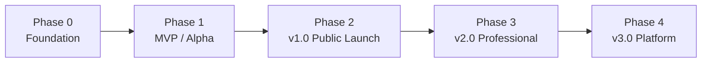
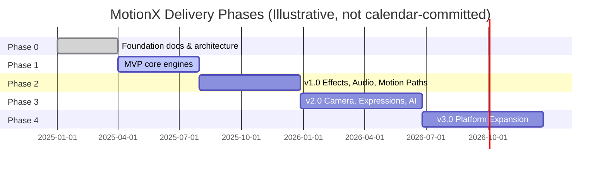

# 011 Roadmap

## Purpose

This document defines the phased delivery plan for MotionX — from foundational architecture through public launch to a fully professional, extensible platform. It sequences engine development, feature exposure, and platform expansion so that every release is a coherent, shippable product rather than a partial feature dump.

## Roadmap Principles

- Each phase must produce a **usable, demoable product** — not a pile of unfinished engines.
- Engines are built in **dependency order**: Project → Timeline → Rendering → Animation → Shape/Text before Effects, Audio, Camera, Expressions, AI.
- No phase ships a feature that compromises **non-destructive editing** or **project file stability**.
- Performance targets (see 005_Rendering_Engine.md) are enforced at every phase, not deferred to "polish later."
- AI features are additive assistance layers introduced only after their underlying manual workflow is solid (see AI Philosophy, master instructions).

---

## Phase Overview

| Phase | Codename | Focus | Target Audience |
|-------|----------|-------|------------------|
| 0 | Foundation | Architecture, ADRs, engine specs | Internal only |
| 1 | MVP / Alpha | Core editing loop works end-to-end | Internal + closed testers |
| 2 | v1.0 Public Launch | Feature-complete for professional short-form work | Public (Android) |
| 3 | v2.0 Professional | Depth features that separate MotionX from consumer editors | Power users, studios |
| 4 | v3.0 Platform | Expansion beyond a single app | Teams, ecosystem |

---

## Phase 0 — Foundation (Complete / In Progress)

**Goal:** Establish the architecture so every later phase builds on stable foundations.

| Deliverable | Document | Status |
|---|---|---|
| Project Charter | 001 | Done |
| PRD | 002 | Done |
| Software Architecture Document | 003 | Done |
| ADRs | 004 | Active |
| Rendering Engine (Aurora) spec | 005 | Done |
| Timeline Engine (Chronos) spec | 006 | Done |
| Animation Engine (Apollo) spec | 007 | Done |
| Effects Engine (Nebula) spec | 008 | Done |
| Project Engine (Atlas) spec | 009 | Done |
| Shape Engine (Vector) spec | 010 | Done |
| Text Engine (Glyph), Audio Engine (Echo), Camera Engine (Horizon), Expression Engine (Pulse) specs | 011–014 (pending) | Not started |
| UI/UX & Design System doc | Pending | Not started |

**Exit criteria:** All 10 core engines named in the SAD have a spec, and RHAL + command/undo architecture are prototyped against at least one engine (recommend Aurora + Chronos first, since every other engine depends on rendering a frame and having a timeline to scrub).

---

## Phase 1 — MVP / Alpha

**Goal:** A single composition can be created, edited, and exported. This is the smallest version of MotionX that is honestly "an editor" rather than a tech demo.

### Feature Scope

| Engine | MVP Scope | Deferred |
|---|---|---|
| Atlas (Project) | Create/open/save, autosave, single composition | Cloud sync, version history |
| Chronos (Timeline) | Add/trim/split/delete layers, scrub, play/pause | Nested compositions, time remapping |
| Aurora (Rendering) | Preview + export at fixed resolution, basic blend modes, frame cache | Adaptive quality, background export |
| Apollo (Animation) | Position/scale/rotation/opacity keyframes, Linear/Hold/Bezier interpolation | Motion paths, graph editor, expressions |
| Vector (Shape) | Basic shapes (rect, ellipse, polygon, line), solid fill/stroke | Boolean ops, modifiers, gradients |
| Glyph (Text) | Static text layer, font/size/color | Animated text presets, text-on-path |
| Nebula (Effects) | Not in MVP scope | Full engine |
| Echo (Audio) | Not in MVP scope | Full engine |

### MVP UX Scope

- Touch-first timeline with pinch-to-zoom
- Single-finger drag for keyframe values, layer trim, playhead scrub
- Minimal layer panel + minimal properties panel
- No AI features yet — manual workflow must be solid first

**Exit criteria:** A tester can open the app, create a composition, add 2–3 shape/text layers, animate position/opacity, and export an MP4 — with autosave protecting their work the entire time.

---

## Phase 2 — v1.0 Public Launch

**Goal:** Feature parity with what a serious mobile creator needs for short-form professional work (Reels, YouTube Shorts, logo stings, lower-thirds).

### Feature Scope

| Engine | v1.0 Additions |
|---|---|
| Nebula (Effects) | Full effect graph, GPU-first blur/color/stylize/distortion categories |
| Apollo (Animation) | Motion paths, Value/Speed graph editor, animation cache |
| Vector (Shape) | Boolean ops (merge/union/intersect/subtract), Trim Paths, Repeater, **Mask Stack + Track Mattes (see 010_Shape_Engine.md § Masking)** |
| Echo (Audio) | Waveform display, volume keyframing, basic audio sync |
| Chronos (Timeline) | Nested compositions, markers, time remapping |
| Aurora (Rendering) | Adaptive quality on low-end devices, background export queue |
| Atlas (Project) | Version migration, integrity checks surfaced in UI |

### Non-Functional Targets

- 60 FPS preview on mid-tier 2023+ Android hardware
- Crash-free autosave/recovery validated across forced-kill test suite
- Vulkan primary path with verified OpenGL ES fallback

**Exit criteria:** Public release on Google Play. Feature set covers the full v1 scope defined in 002_Product_Requirements_Document.md.

---

## Phase 3 — v2.0 Professional

**Goal:** Introduce the depth and intelligence that separates MotionX from consumer-grade mobile editors and starts closing the gap with desktop tools.

### Feature Scope

| Engine | v2.0 Additions |
|---|---|
| Horizon (Camera) | 3D camera layers, depth-based compositing |
| Pulse (Expression) | Expression-driven properties, linked parameters |
| Nebula (Effects) | Node editor, compute shader effects |
| Apollo (Animation) | Spring/physics interpolation, IK (basic) |
| Vector (Shape) | SVG import, shape libraries, live corners |

### AI-Assisted Features (introduced here, not earlier)

- Object selection (tap-to-select subject)
- Auto masking / rotoscoping
- Motion tracking
- Auto captions
- Smart effect/preset suggestions

Per the AI Philosophy in the master instructions, each AI feature ships only as an accelerator on top of an existing manual workflow — never as the only way to do the task.

### Platform

- Effect Plugin SDK (initial, sandboxed)
- Community preset library (read-only browsing first, publishing later)

**Exit criteria:** A motion designer can complete work that previously required switching to a desktop tool for camera-based 3D moves, expressions, or tracking.

---

## Phase 4 — v3.0 Platform Expansion

**Goal:** MotionX becomes a platform, not just an app.

| Track | Scope |
|---|---|
| Cross-platform | iOS build sharing the core engines via shared Kotlin Multiplatform or equivalent strategy (needs its own ADR) |
| Collaboration | Cloud project sync, multi-user commenting, shared asset libraries |
| Ecosystem | Public plugin marketplace, publishable community presets/templates |
| Advanced rendering | Multi-GPU/tile-based export for very high resolutions, HDR pipeline |

**Exit criteria:** Defined per-track in future ADRs — this phase is intentionally less specified today since it depends on v1/v2 usage data and business priorities at that time.

---

## Cross-Phase Timeline (Illustrative)

---

## Risks

| Risk | Impact | Mitigation |
|---|---|---|
| Scope creep into Phase 1 (adding Effects/Audio too early) | Delays first shippable build indefinitely | Enforce MVP table strictly; new engine = new phase, not MVP addition |
| Vulkan compatibility gaps on low/mid-end Android GPUs | Broken preview/export for a large user segment | RHAL abstraction (ADR-003) keeps OpenGL ES fallback production-ready, not an afterthought |
| Project format changes breaking older saved projects | User data loss, trust damage | Versioned `.mxproj` format + migration path (see 009_Project_Engine.md) enforced from Phase 1 onward |
| AI features shipped before manual workflow is solid | Users trust AI over their own control, or AI masks a weak core editor | AI Philosophy gate: no AI feature ships before Phase 3, and only as an accelerator |
| Missing engine specs (Glyph, Echo, Horizon, Pulse) delay Phase 1/2/3 planning | Teams start building without a spec to align to | Prioritize writing 011–014 engine specs before Phase 1 implementation begins |

---

## Developer Notes

- Treat this roadmap as a **living document** — update phase tables as engines complete, don't create a separate "actual roadmap" outside version control.
- Each phase's "Exit criteria" should become a literal checklist/issue template when implementation starts.
- The Gantt chart above is illustrative structure, not a committed schedule — replace with real dates once team capacity is known.

## Future Improvements

- Attach a RACI or ownership table per phase once the team has named contributors.
- Convert phase feature tables into linked GitHub Projects / issues for tracking.
- Add a "Definition of Done" checklist per engine (tests, docs, performance budget met) referenced from this roadmap.

## Related Documents

- 001_Project_Charter.md
- 002_Product_Requirements_Document.md
- 003_Software_Architecture_Document.md
- 005_Rendering_Engine.md
- 006_Timeline_Engine.md
- 007_Animation_Engine.md
- 008_Effects_Engine.md
- 009_Project_Engine.md
- 010_Shape_Engine.md

## Revision History

- 0.1.0 Initial roadmap draft
- 
