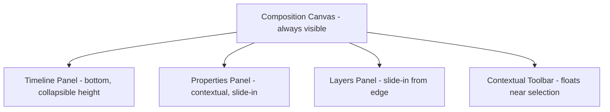

# 016 UI/UX Specification

## Purpose

This document defines how MotionX's professional editing capability is exposed through a touch-first interface. Every engine spec in this repository (005–014) has referenced gesture-based interaction, touch-friendly authoring, and minimized typing — this document is where those references become concrete, testable interaction rules.

The core design problem MotionX must solve: **desktop motion graphics tools assume a mouse, a keyboard, and a large screen with room for a dozen panels open at once. MotionX has none of those.** The answer is not to shrink the desktop UI — it's to redesign the workflow around what touch does better than mouse+keyboard (direct manipulation, gesture shorthand, spatial memory) and compensate for what it does worse (precision, multi-panel visibility, modifier-key combinations).

## Design Principles

- **Direct manipulation over menus.** If a property can be touched and dragged, it should be — properties panels are a fallback for precision input, not the primary interaction.
- **One primary action per screen region.** No screen should ask the user to choose between more than a few live gesture zones at once (see Gesture Zones below).
- **Progressive disclosure.** Basic actions require one tap; advanced actions are reachable but not default-visible (mirrors Pulse's Advanced expression editor pattern from 014).
- **Never block the canvas.** Panels overlay or dock at the edges; the composition preview is never fully obscured during editing.
- **Consistent gesture grammar.** The same gesture means the same thing everywhere in the app (e.g., two-finger rotate always rotates, never something else contextually).
- **Undo is always one tap away.** Given the command-based architecture (ADR-005), the UI must expose this — never bury undo in a menu.

## Visual Language

Inspired by (not copied from): Arc Browser, Linear, Figma, Apple HIG, Lightroom.

| Attribute | Direction |
|---|---|
| Color | Dark-first UI (standard for video/motion tools — accurate color perception, less eye strain during long sessions), with a light mode as a secondary option |
| Typography | Single clean sans-serif family, strong size hierarchy between primary actions and secondary metadata |
| Density | Medium — professional tools skew dense, but MotionX must stay touch-target-safe (minimum 44×44dp per Android accessibility guidance) |
| Motion | The UI's own transitions should demonstrate the same easing quality Apollo produces — a motion graphics app with clumsy UI animation undermines its own premise |
| Iconography | Custom icon set, not default Material icons — reinforces "professional tool," not "generic Android app" |

## Screen Architecture

- **Canvas** is the permanent anchor. Every other panel is transient relative to it.
- **Timeline** docks to the bottom and is resizable by drag, collapsible to a thin scrubber when the user needs maximum canvas space.
- **Properties** and **Layers** panels slide in from screen edges on demand rather than occupying permanent screen real estate — this is the single biggest departure from desktop tools, where these panels are always docked and visible.
- **Contextual toolbar** floats near the current selection (similar to Figma's selection toolbar) rather than living in a fixed top/side bar, keeping frequently-used actions within thumb reach of whatever the user is currently touching.

## Gesture Grammar

| Gesture | Action | Applies To |
|---|---|---|
| Single tap | Select | Layers, keyframes, UI elements |
| Single-finger drag | Move / reposition | Layer position, keyframe value, playhead |
| Two-finger pinch | Scale | Layer scale, timeline zoom (context-dependent) |
| Two-finger rotate | Rotate | Layer rotation |
| Two-finger drag | Pan | Canvas pan, timeline scroll |
| Long-press | Context menu / secondary options | Layers, keyframes |
| Long-press + drag | Pick-whip (property linking, per 014_Expression_Engine.md) | Properties panel |
| Double tap | Reset to default / fit-to-view | Property values, canvas zoom |
| Swipe (panel edge) | Open/close slide-in panel | Layers, Properties |

This table is the authoritative gesture reference — any new feature must map onto this grammar rather than inventing a one-off gesture, per the Design Principles above.

## Timeline UX (extends 006_Timeline_Engine.md)

- Pinch-to-zoom on the timeline itself (horizontal = time scale, matches Chronos's frame-accurate model)
- Layer rows are touch-draggable for reordering, with haptic feedback on drop (Android `HapticFeedbackConstants`)
- Keyframes render as touch targets no smaller than 44dp regardless of zoom level — hit-testing area is decoupled from visual keyframe marker size at high zoom-out
- Trim handles at clip edges are enlarged touch zones, not 1:1 with the visual clip boundary

## Properties Panel UX

- Numeric properties support: tap-to-type (precision), drag-to-scrub (speed), and a small stepper for fine adjustment — three input modes for three different precision needs, consistent with how professional tools (Lightroom, Figma) handle numeric input on touch
- Keyframe toggle (stopwatch icon, matching the established After-Effects-literate mental model creators already have) sits directly next to each animatable property
- Color properties open a full-screen or large-sheet color picker — color selection is one of the worst-served interactions on small touch targets if compressed into a small popover

## Onboarding & Progressive Disclosure

- First-run experience teaches the gesture grammar directly on a live canvas (learn by doing), not a slideshow of static screens
- Advanced features (expressions text editor, node-based effects graph from 008/014) are reachable from standard entry points but never shown by default to a new user
- Contextual tips tied to first use of a feature (e.g., first time opening Properties panel briefly highlights the pick-whip affordance), not a persistent tutorial overlay

## Accessibility

- Minimum touch target size 44×44dp (Android accessibility baseline)
- Sufficient contrast ratios in both dark and light modes (WCAG AA minimum)
- All gesture-based actions have a discoverable non-gesture alternative (e.g., rotate is also available as a numeric field, not gesture-only) — critical for both accessibility and precision editing
- Screen reader labels on all custom-drawn UI elements (canvas layers, timeline clips), since these are not standard Android widgets and won't get accessibility support for free

## Performance Considerations

- UI thread must remain responsive during canvas rendering — per the Threading Model in 003_Software_Architecture_Document.md, UI interactions (panel animation, gesture tracking) must never block on the Rendering Thread
- Panel slide-in/out animations run on the UI thread's own composition, decoupled from render-thread frame production, so a slow render frame never causes a stuttering panel animation (and vice versa)

## Future Improvements

- Adaptive layout for tablets / foldables (more permanent panel space when screen size allows, without changing the underlying gesture grammar)
- Customizable gesture bindings for power users
- Voice input for text layer content (accessibility + speed)

## Developer Notes

- This spec defines interaction rules, not final visual mockups — high-fidelity screens should be produced as a separate design deliverable (Figma or equivalent) that conforms to this document, not the other way around.
- Any new panel or feature added to the app should be checked against the Gesture Grammar table before implementation — inventing new gesture meanings fragments the mental model users build over time.

## Related Documents

- 003_Software_Architecture_Document.md
- 006_Timeline_Engine.md
- 007_Animation_Engine.md
- 014_Expression_Engine.md
- 015_Roadmap.md

## Revision History

- 0.1.0 Initial draft
