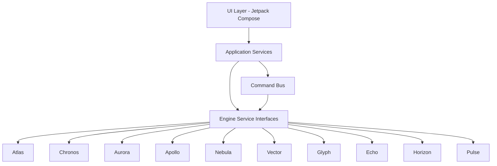
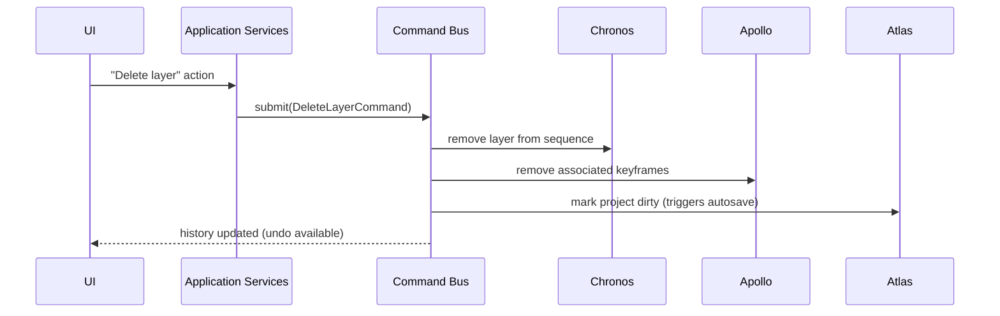

# 017 API Specification

## Purpose

This document defines MotionX's internal API surface — the stable contracts between the UI layer, Application Services, and the ten Core Engines (per the layered architecture in 003_Software_Architecture_Document.md) — and lays the groundwork for the future external Plugin SDK referenced in 008_Effects_Engine.md and 015_Roadmap.md (Phase 3).

MotionX is not a networked service; "API" here means **module contracts**, not REST/HTTP endpoints. Getting these contracts right matters as much as any external API would, because every engine (005–014) was specified independently and they now need to interoperate through something concrete.

## API Philosophy

- **UI never talks to engines directly.** All access flows through Application Services, which mediate, coordinate cross-engine concerns (e.g., a single user action touching Chronos, Apollo, and Atlas at once), and expose a UI-friendly reactive surface.
- **Every mutation is a Command.** Per ADR-005, state changes are not made by directly setting properties — they're issued as Command objects that the Command Bus executes, tracks, and can undo. This is the single most important API rule in the app: **if it's not a Command, it can't be undone, and if it can't be undone, it doesn't belong in the editing surface.**
- **Engines expose services, not shared mutable state.** Cross-engine reads happen through defined interfaces, never through reaching into another engine's internal data structures.
- **Reactive by default.** State changes are observed via streams (Kotlin `Flow`), not polled — UI recomposition (Jetpack Compose) depends on this.
- **Internal APIs are versioned like external ones would be**, in anticipation of the Plugin SDK eventually exposing a subset of this surface publicly.

## Layered API Surface



This mirrors the SAD's high-level layers directly — this document is where "Application Services" and "Core Engines" become concrete interfaces rather than boxes in a diagram.

## Command API

The central API surface. Every user-initiated edit becomes a `Command`.

```kotlin
interface Command {
    val id: UUID
    fun execute(context: EditContext)
    fun undo(context: EditContext)
    fun mergeWith(next: Command): Command?  // e.g., coalesce drag-in-progress updates
}

interface CommandBus {
    fun submit(command: Command)
    fun undo()
    fun redo()
    val history: Flow<List<Command>>
}
```

- `mergeWith` exists specifically for high-frequency touch input (e.g., a single-finger drag emits many position updates per second) — these coalesce into one undo step rather than flooding history with hundreds of entries per gesture, per the Gesture Grammar in 016_UIUX_Specification.md.
- Every engine mutation described below (layer add/remove, keyframe set, effect apply, etc.) is issued as a `Command`, not a direct method call, when it originates from user editing. Engines may still expose direct read-only query methods.

## Engine Service Interfaces

Each engine exposes one primary service interface. This is not exhaustive — it defines the shape, not the full method set, which belongs in each engine's own spec.

| Engine | Interface | Primary Responsibility Exposed |
|---|---|---|
| Atlas (009) | `ProjectService` | Open/save/autosave, asset registry queries |
| Chronos (006) | `TimelineService` | Playback state, layer sequencing queries, time navigation |
| Aurora (005) | `RenderService` | Frame requests (preview + export), diagnostics stream |
| Apollo (007) | `AnimationService` | Property evaluation, keyframe CRUD (via Command) |
| Nebula (008) | `EffectsService` | Effect graph queries, effect apply/remove (via Command) |
| Vector (010) | `ShapeService` | Shape CRUD, boolean ops (via Command) |
| Glyph (011) | `TextService` | Text layer CRUD, shaping queries |
| Echo (012) | `AudioService` | Playback sync clock, waveform queries, mix control |
| Horizon (013) | `CameraService` | Camera CRUD, 3D transform queries |
| Pulse (014) | `ExpressionService` | Expression CRUD, dependency graph validation |

### Example: Minimal Service Shape

```kotlin
interface AnimationService {
    fun evaluateProperty(propertyId: UUID, atTime: FrameTime): PropertyValue
    fun observeProperty(propertyId: UUID): Flow<PropertyValue>
    // Mutations issued as Commands via CommandBus, not direct calls:
    // e.g., SetKeyframeCommand(propertyId, time, value)
}
```

Read paths (`evaluateProperty`, `observeProperty`) are direct — engines are allowed to be queried freely, since queries can't corrupt state or need undo. Write paths always route through a `Command`.

## Cross-Engine Coordination

Some user actions span multiple engines in a single logical operation. These are expressed as **composite commands** at the Application Services layer, not chained calls made by the UI.



This keeps the UI layer ignorant of which engines a given action touches — the UI issues one intent, the composite command owns the coordination, and undo reverses all of it atomically.

## Event / Observation API

- UI observes state exclusively through `Flow` streams exposed by Application Services (which aggregate/filter engine-level flows) — never through direct engine subscriptions, to keep the UI layer decoupled from engine internals per the Architecture Principles in 003.
- Diagnostics streams (Aurora's FPS/frame time, Echo's levels, Horizon's depth-sort cost) are exposed separately as a `DiagnosticsService`, gated behind Developer Mode, so production UI paths never pay the cost of diagnostics collection unless explicitly enabled.

## Plugin SDK (Future — Phase 3, Sandboxed Subset)

Per 008_Effects_Engine.md and 015_Roadmap.md, a public Plugin SDK is planned for Phase 3. It will expose a **restricted subset** of this internal API surface:

| Exposed to Plugins | Not Exposed to Plugins |
|---|---|
| Effect parameter read/write within a plugin's own effect node | Direct Command Bus access |
| Expression function registration (bounded, per Pulse's sandbox model in 014) | Project file structure mutation |
| Read-only queries on the active composition | Any other plugin's data |
| GPU compute shader submission via RHAL, sandboxed | Direct GPU/RHAL access outside the sandbox |

The internal/external split is intentional: internal engine code is trusted and can use the full API; third-party plugin code is untrusted and gets a narrow, audited surface — designing the internal API with this boundary in mind now avoids a painful retrofit in Phase 3.

## Versioning Strategy

- Internal service interfaces are versioned per-engine, matching each engine spec's own `version` field in its front-matter
- Breaking changes to a service interface require an ADR (per the pattern in 004_Architecture_Decision_Records.md), since they ripple into Application Services and potentially the UI layer
- The future Plugin SDK will follow semantic versioning independently, once it exists, since external plugin authors need stronger compatibility guarantees than internal refactors do

## Error Handling

- Command execution failures (e.g., invalid state) surface through the Command Bus as a rejected command, not a thrown exception that crashes the UI — the UI is expected to handle rejection gracefully (non-blocking toast/indicator), consistent with the error-handling patterns already established per-engine (005–014)
- Engine service queries return explicit error/empty states rather than throwing, wherever the query can meaningfully fail (e.g., querying a deleted layer's property)

## Developer Notes

- This spec defines contracts, not implementations — actual Kotlin interfaces will evolve, but additions should be additive where possible rather than breaking, per the Versioning Strategy above.
- New engines or services added in future phases should follow the same shape: one primary service interface, read paths direct, write paths through Commands.

## Future Improvements

- Formal interface definition (e.g., generated from a schema) once implementation begins, to keep this document and the actual code from drifting
- Public plugin API reference, split out as its own document once Phase 3 scoping begins

## Related Documents

- 003_Software_Architecture_Document.md
- 004_Architecture_Decision_Records.md (ADR-005: Command Pattern)
- 008_Effects_Engine.md
- 014_Expression_Engine.md
- 016_UIUX_Specification.md
- 015_Roadmap.md

## Revision History

- 0.1.0 Initial draft
