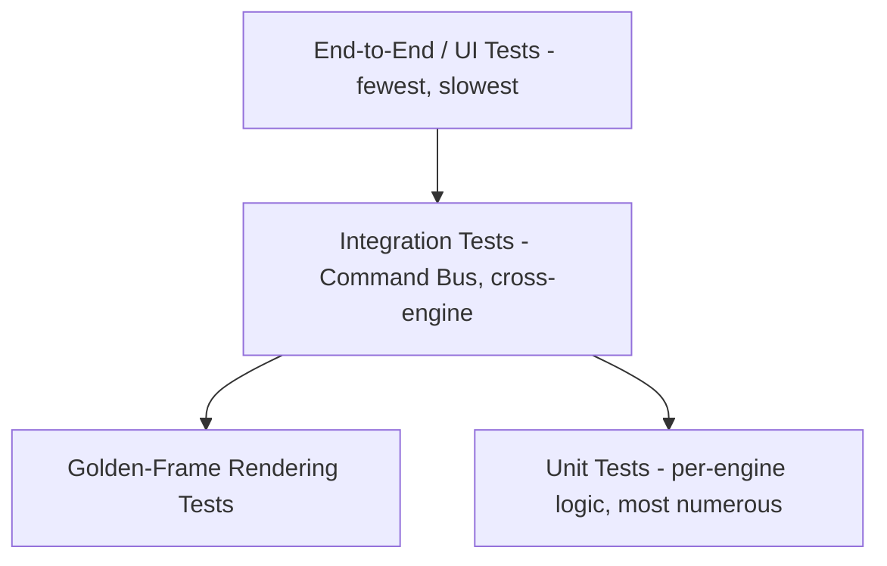
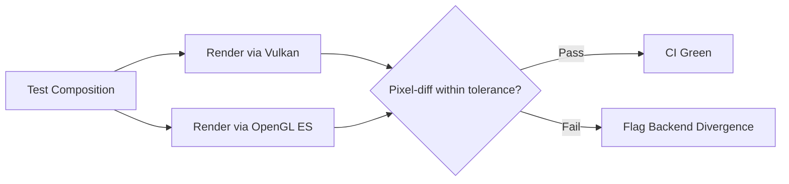

# 018 Testing Strategy

## Purpose

This document defines how MotionX's correctness, performance, and stability are verified across ten interdependent engines, a command-based undo system, and a GPU-accelerated rendering pipeline running on fragmented Android hardware. Motion graphics software fails in ways generic apps don't — a single dropped frame, a sync drift of a few milliseconds, or a keyframe that doesn't round-trip through save/load is a correctness bug, not a cosmetic one. Testing strategy has to be designed around that, not bolted on afterward.

## Testing Philosophy

- **Determinism is the foundation.** Per 014_Expression_Engine.md and 007_Animation_Engine.md, evaluation must be deterministic (same timeline position → same output). This makes most of the engine layer highly testable with straightforward input/output assertions — determinism isn't just a feature requirement, it's what makes automated testing of animation possible at all.
- **The Command Bus is the seam.** Since every mutation flows through Commands (017_API_Specification.md), most integration tests can be written as: submit a sequence of commands → assert resulting state → undo → assert state matches pre-command snapshot. This one pattern covers a large fraction of engine + cross-engine test surface.
- **Test on real low/mid-end hardware, not just emulators or flagship devices.** Performance targets (60 FPS, sub-50ms scrub latency) are meaningless if only validated on high-end devices when the target audience skews toward mid-tier Android hardware.
- **Golden-frame testing for rendering.** Visual/rendering correctness is verified by rendering known compositions and comparing output against approved reference frames, not just by unit-testing the math in isolation.

## Test Pyramid

| Layer | What it covers | Volume |
|---|---|---|
| Unit | Individual engine logic (interpolation math, shape boolean ops, expression evaluation, waveform generation) | High |
| Golden-Frame | Rendered output correctness for known compositions | Medium |
| Integration | Command Bus flows, cross-engine coordination (e.g., delete layer → keyframes + timeline + autosave all update) | Medium |
| End-to-End / UI | Full gesture-driven user flows on real devices | Low, targeted |

## Per-Engine Test Focus

| Engine | Critical Test Areas |
|---|---|
| Atlas (Project) | Save/load round-trip fidelity, format version migration, corrupt-file recovery, autosave reliability under forced-kill |
| Chronos (Timeline) | Frame-accurate sequencing, trim/split edge cases, nested composition time mapping |
| Aurora (Rendering) | Golden-frame comparisons, RHAL backend parity (Vulkan vs OpenGL ES fallback must render identically), frame cache correctness |
| Apollo (Animation) | Interpolation math correctness (Linear/Hold/Bezier) against known reference curves, keyframe CRUD via Command Bus |
| Nebula (Effects) | Per-effect golden-frame output, effect graph ordering, GPU shader correctness across RHAL backends |
| Vector (Shape) | Boolean operation correctness (union/subtract/intersect edge cases — self-intersecting paths, degenerate shapes) |
| Glyph (Text) | Shaping correctness across scripts, glyph cache invalidation, text-to-shape conversion fidelity |
| Echo (Audio) | Sample-accurate sync drift over long timelines, mixdown fidelity, waveform cache accuracy |
| Horizon (Camera) | Depth-sort correctness, zero-cost verification for 2D-only compositions (regression guard), projection math |
| Pulse (Expression) | Determinism (same input → same output across runs), cycle detection, instruction budget enforcement, sandbox escape prevention |

## RHAL Backend Parity Testing

Because Aurora abstracts Vulkan and OpenGL ES behind the RHAL (ADR-003), **every golden-frame test runs on both backends** and asserts visually equivalent output within a defined tolerance. This is one of the highest-risk areas flagged in the Roadmap (015) — backend divergence would silently break rendering for whichever segment of devices falls back to OpenGL ES, and that would only be caught by explicit parity testing, not by testing either backend alone.

## Command Bus / Undo Testing

Every composite command (017_API_Specification.md) gets a standard test shape:

1. Capture state snapshot before command
2. Execute command
3. Assert resulting state across all affected engines
4. Undo
5. Assert state matches the original snapshot exactly (not "close enough")

This directly targets the failure mode of an undo that reverses some but not all of a composite command's effects — which per the API spec's sequence diagram (delete layer touching Chronos, Apollo, and Atlas) is an easy bug to introduce without a test forcing full-state comparison.

## Performance Testing

| Target (from engine specs) | Test Method |
|---|---|
| 60 FPS preview, mid-tier 2023+ Android | Automated frame-time capture on a fixed device lab, run per build |
| Sub-50ms audio scrub latency (Echo) | Instrumented latency measurement, not manual stopwatch testing |
| Zero sync drift over 10-minute timeline (Echo) | Long-duration automated playback with sample-position assertions at intervals |
| Zero cost for 2D-only compositions (Horizon) | Frame-time regression test comparing 3D-disabled compositions before/after Horizon changes |
| Expression instruction budget enforcement (Pulse) | Adversarial test expressions designed to exceed budget, assert graceful fallback |

## Device Lab

- Minimum: one low-end, one mid-tier, one flagship physical Android device, covering both Vulkan-capable and OpenGL ES fallback paths
- Performance and golden-frame tests run against this matrix in CI, not just on developer machines
- Device lab composition revisited each phase as target hardware assumptions shift (see 015_Roadmap.md phase targets)

## Manual / Exploratory Testing

Automated tests cover correctness and performance regressions; they do not cover UX feel. Per 016_UIUX_Specification.md's gesture grammar, each release includes structured manual passes on:

- Gesture grammar consistency (does two-finger rotate always rotate, everywhere it should)
- Touch target accessibility (44dp minimum, verified on-device, not just measured in layout)
- Onboarding flow completion by testers unfamiliar with the app

## CI/CD Integration

- Unit + golden-frame + integration tests run on every commit
- Full device-lab performance suite runs on release-candidate builds, not every commit (cost/time tradeoff)
- A failing RHAL parity test blocks merge — this is treated as a correctness bug, not a warning, given its risk ranking in the Roadmap

## Error Handling & Recovery Testing

Every "Error Handling" section across the ten engine specs (005–014) describes a fallback behavior (missing font, corrupt audio, cyclic expression, etc.) — each of these is a required test case, not an implied one. A checklist derived directly from those sections should be maintained alongside this document so no documented fallback path ships unverified.

## Future Improvements

- Fuzz testing for Pulse's expression sandbox (adversarial inputs attempting to escape the sandbox or exceed budget)
- Automated visual regression testing integrated into the UI/UX manual pass, reducing reliance on purely manual gesture verification
- Crash/ANR monitoring dashboards tied to the device lab matrix once a broader beta pool exists

## Related Documents

- 003_Software_Architecture_Document.md
- 004_Architecture_Decision_Records.md
- 017_API_Specification.md
- 016_UIUX_Specification.md
- 015_Roadmap.md
- All engine specs, 005–014 (each contributes required test cases via its Error Handling section)

## Revision History

- 0.1.0 Initial draft
