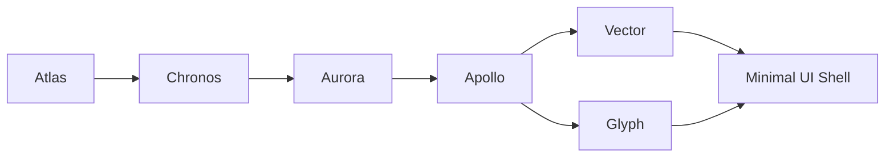

# 020 MVP Implementation Checklist

## Purpose

015_Roadmap.md defines Phase 1 (MVP) scope at the feature-table level. This document breaks that scope into an ordered, checkable implementation sequence — the bridge between "we have specs" and "we are writing code." This is a living execution document, not a frozen spec; check items off and add sub-tasks as implementation reveals detail the specs didn't anticipate.

## Build Order Rationale

Engines are implemented in dependency order, not spec-numbering order. Nothing renders without Atlas holding project state and Chronos providing a timeline; nothing animates without Apollo; nothing is visible without Aurora. Shape and Text are the first two content-producing engines because MVP scope explicitly excludes Effects, Audio, Camera, and Expressions (per Roadmap Phase 1 table).

## Stage 1 — Project & Timeline Foundation

- [ ] Atlas: project create/open/save (`.mxproj` format, versioned per 009)
- [ ] Atlas: autosave on a fixed interval + on significant edit
- [ ] Atlas: crash recovery (forced-kill test per 018_Testing_Strategy.md)
- [ ] Chronos: single-composition timeline model, UUID-referenced layers
- [ ] Chronos: play/pause/scrub, frame-accurate positioning
- [ ] Chronos: add/trim/split/delete layer operations, each as a Command (017)
- [ ] Command Bus: core implementation (submit/undo/redo/history) per 017_API_Specification.md
- [ ] Integration test: create project → add layer → save → close → reopen → verify state (per 018)

**Exit check:** A composition can be created, hold layers, be scrubbed, saved, and reloaded with zero data loss.

## Stage 2 — Rendering Path

- [ ] RHAL: Vulkan backend minimal implementation
- [ ] RHAL: OpenGL ES fallback minimal implementation
- [ ] Aurora: frame request/composite pipeline for basic layer stack
- [ ] Aurora: basic blend modes (Normal, Multiply, Screen — per MVP scope, not full set)
- [ ] Aurora: frame cache (avoid re-rendering unchanged frames on scrub)
- [ ] Golden-frame test harness stood up (per 018), even with minimal test compositions
- [ ] RHAL parity test running in CI (Vulkan vs OpenGL ES output comparison) — per ADR risk flag, this should exist before content engines are built on top, not after

**Exit check:** A composition with placeholder colored layers renders identically (within tolerance) on both RHAL backends, cached correctly on scrub.

## Stage 3 — Animation

- [ ] Apollo: keyframe data model, UUID-referenced properties
- [ ] Apollo: Linear, Hold, Bezier interpolation
- [ ] Apollo: keyframe CRUD via Command Bus
- [ ] Apollo: property evaluation at arbitrary timeline position (determinism verified per 018)
- [ ] Position/Scale/Rotation/Opacity exposed as animatable on generic layers

**Exit check:** A layer's opacity/position can be keyframed, scrubbed, and the interpolation is visually and numerically correct against reference curves.

## Stage 4 — Content Engines (Shape + Text)

- [ ] Vector: basic shapes (rect, ellipse, polygon, line)
- [ ] Vector: solid fill + stroke, no gradients yet (deferred to v1.0 per Roadmap)
- [ ] Vector: shape layer integrates with Apollo (animatable shape properties)
- [ ] Glyph: static text layer, font/size/color
- [ ] Glyph: font fallback chain (per 011 error handling)
- [ ] Glyph: text layer integrates with Apollo

**Exit check:** Shape and text layers can be created, styled, positioned, and animated using the Stage 1–3 foundation, with no dependency on Effects/Audio/Camera/Expressions.

## Stage 5 — Minimal Touch UI

- [ ] Canvas view (permanent, per 016_UIUX_Specification.md)
- [ ] Timeline panel (bottom-docked, collapsible)
- [ ] Minimal Layers panel (slide-in)
- [ ] Minimal Properties panel (slide-in, tap-to-type + drag-to-scrub per 016)
- [ ] Core gesture grammar implemented: tap-select, single-finger drag, pinch-scale, two-finger rotate, two-finger pan (per 016 Gesture Grammar table — MVP does not need pick-whip, that's Pulse/v2.0)
- [ ] Undo control always visible (per 016 Design Principles)
- [ ] Minimum 44dp touch targets verified on-device (per 016 Accessibility)

**Exit check:** A tester can perform every MVP action (create/edit/animate/export) using only touch, with the gesture grammar behaving consistently across all panels.

## Stage 6 — Export

- [ ] Aurora: export pipeline, fixed resolution (per Roadmap MVP scope — adaptive quality is v1.0)
- [ ] MP4 output via platform encoder
- [ ] Export progress UI, non-blocking (does not freeze editing UI)

**Exit check:** A composition exports to a playable MP4 matching the preview.

## Stage 7 — MVP Validation (maps to Roadmap Exit Criteria)

- [ ] End-to-end manual test: create composition → add 2–3 shape/text layers → animate position/opacity → export MP4 (this is the Roadmap's literal Phase 1 exit criteria — treat it as the MVP's acceptance test, not just a checklist item)
- [ ] Autosave validated across the entire flow above via forced-kill testing
- [ ] Device lab pass (low/mid/flagship, per 018) on the full flow
- [ ] Every "Error Handling" fallback documented in Atlas, Chronos, Aurora, Apollo, Vector, and Glyph specs has a corresponding passing test (per 018's Error Handling & Recovery Testing section)

## Explicitly Not in MVP (Do Not Scope-Creep These In)

Per Roadmap Phase 1 table — these belong to v1.0 or later and should be rejected if proposed mid-Stage:

- Effects (Nebula) — any effect, even "simple" ones
- Audio (Echo) — any audio layer support
- Camera (Horizon) — any 3D functionality
- Expressions (Pulse) — even basic wiggle
- Nested compositions, motion paths, graph editor, boolean shape ops, gradients, masking/track mattes (see 010_Shape_Engine.md § Masking — spec exists, but deferred to v1.0 per Roadmap)
- Any AI feature (gated to Phase 3 per 019_AI_Features.md)

If a Stage 1–6 task seems to require one of these, that's a signal the task needs re-scoping to its MVP-safe subset, not a reason to pull the dependency in early.

## Developer Notes

- Check off items as merged, not as started — this tracks shipped state, not in-progress work
- If an item reveals it should be split into sub-tasks during implementation, split it in this document rather than tracking the breakdown elsewhere, so this stays the single source of truth for MVP progress
- Stage boundaries are dependency gates, not strict calendar phases — Stage 4 work can start once Stage 3's exit check passes, without waiting for a formal "Stage 3 complete" ceremony

## Related Documents

- 015_Roadmap.md (source of Phase 1 scope)
- 017_API_Specification.md (Command Bus, referenced throughout)
- 018_Testing_Strategy.md (exit-check testing patterns)
- 016_UIUX_Specification.md (Stage 5 gesture grammar)
- 004_Architecture_Decision_Records.md (ADR-007 through ADR-012 inform build order and RHAL parity priority)

## Revision History

- 0.1.0 Initial checklist, derived from Roadmap Phase 1 scope
- 
